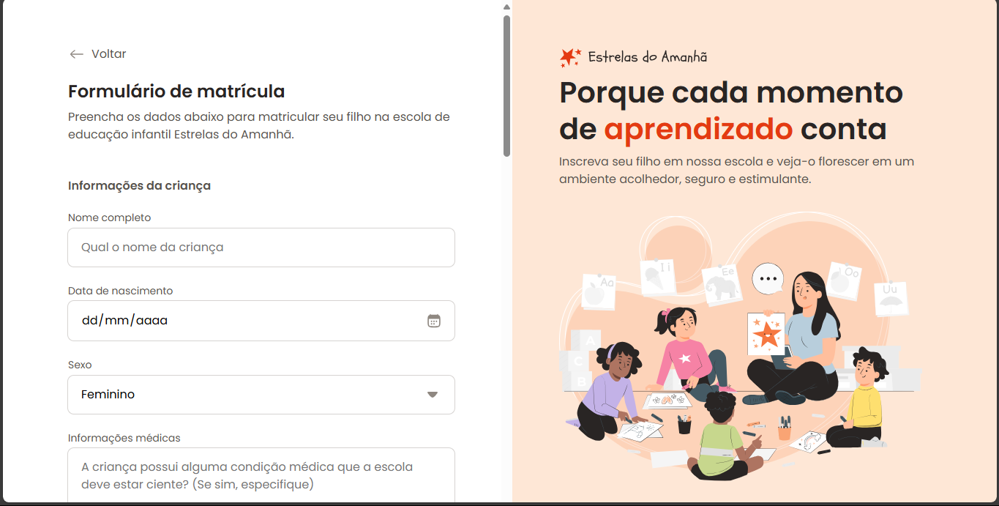

# Formulário de matricula

Projeto de um Formulário de matrícula.

  <a href="#-tecnologias">Tecnologias</a>

 

  

## 🚀 Tecnologias

Esse projeto foi desenvolvido com as seguintes tecnologias:

- HTML
- CSS
